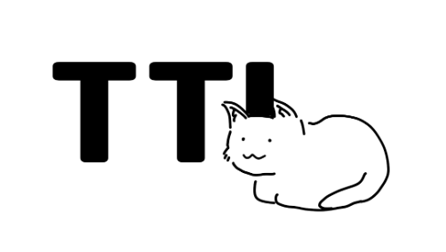

# Background
Building a high-quality web application using web application frameworks is not easy, even more so when we are building out from scratch. 

There is simply too much stuff to consider
- authentication of users
- storing of the content
- restricting what users can access, and developing a new admin page. 

All these require extensive coding time, and it can be quite stressful within a short timeframe.
 

 

# What is Tom Tom Load?
Tom Tom Load (TTL) is a headless content management system. It’s meant to assist your development process, allowing content creators to focus on their crafts. 

Out of the box, TTL gives you many things that you often need when developing a new website or web app, for example:
1. Google Cloud Storage database to store your data
2. A way to store, retrieve, and manipulate data via REST APIs
3. Authentication — registration, email verification, login, & password reset
4. Access control to your data
5. Beautiful admin UI

 

to view better: https://excalidraw.com/#json=kHNIBGzY1ThEAcyfjM9XN,s37UlgOKkBxLgnKVrFyBKg

 
By: Sze Yan, Yee Ping, Stefanie, Mizuki, Jolin